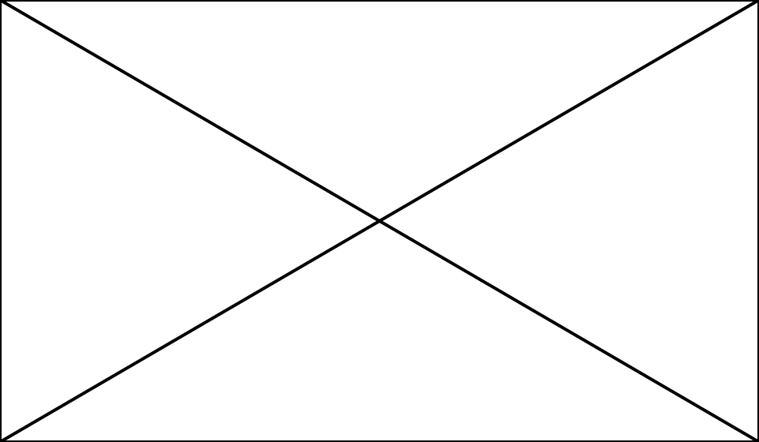

# Titel van de presentatie

Dit type presentatie moet op een webserver getoond worden, gelukkig kan je op een mac in de terminal met een simpel commando een webserver starten. Dit werkt als volgt:

1. Start het programma 'terminal'
2. Navigeer met het commando 'cd' naar de juiste map
3. Geef het volgende commando om een webserver te starten:

Let op hoofd en kleine letters!

	python -m SimpleHTTPServer

Open nu de URL *http://localhost:8000* in je browser.

Uitroeptekens met witregels er voor en er na scheiden twee dia's van elkaar.

!

# Er zijn meerdere niveau's
## koppen. Je kunt op een pagina
### alle niveau's tegelijk inzetten
#### maar of dat je presentatie ten 
##### goede komt...

Koppen worden aangegeven door een of meerdere hekjes # aan het begin van de regel toe te voegen.

!

# Opsommingen
Het is voor markdown lastig om twee verschillende soorten opsommingen op een pagina te onderscheiden. Zet daarom altijd platte tekst tussen een met punten en met getallen aangegeven opsomming.

- In markdown en HTML zijn twee soorten opsommingen
- de eerste vorm is een lijst met punten voor aan de regel
- deze wordt aangegeven met streepjes - aan het begin van de regel

=== Ook tekens gelden als platte tekst (^.^)

1. de tweede vorm is een opsomming met getallen
2. deze wordt gemarkeerd met getallen en een punt
3. aan het begin van de tekstregel.

!

Afbeeldingen worden automatisch uitgerekt tot de breedte van de dia. Je kunt op hoge resoluties zoomen met de native browser zoom functie (cmd/ctrl +).

!

De beschrijving van een afbeelding is een verplicht HTML onderdeel, je ziet het in de presentatie verder niet terug. SVG bestanden werken het beste omdat die op elke resolutie scherp getoond worden.

!

# Tekstuele zaken
Je kunt tekst **vet-** of *schuingedrukt* maken door respectievelijk een of twee sterretjes * om een woord heen te zetten.

> Bij citaten begin je de regel met een groter-dan teken >, zolang je geen enter gebruikt loopt het citaat door. Als je meerdere alinea's wilt opnemen zal je opnieuw een groter-dan teken voor de nieuwe alinea moeten gebruiken. Citaten worden automagisch schuingedrukt en ingesprongen.

!

# Codevoorbeelden

Code voorbeelden zijn supereenvoudig

	// Een tab aan het begin van de regel is genoeg
	var whee = function (foo, bar) {
		console.log([foo, bar].join(' '));
	}

!

# Links
Omdat we in een browseromgeving werken kunnen links direct aangeklikt worden, erg handig voor studenten en docenten. Een link neem je op door een [speciale syntax](http://example.com/ "Title") te gebruiken.

[opschrift]
(http://www.link.com "beschrijving")

!

# Vragen?
Als je vragen hebt mag je die komen stellen ^^d

ps: Ohja, je kunt snel naar een bepaalde dia springen door het dianummer in te typen, gevolgd door 'Enter'.