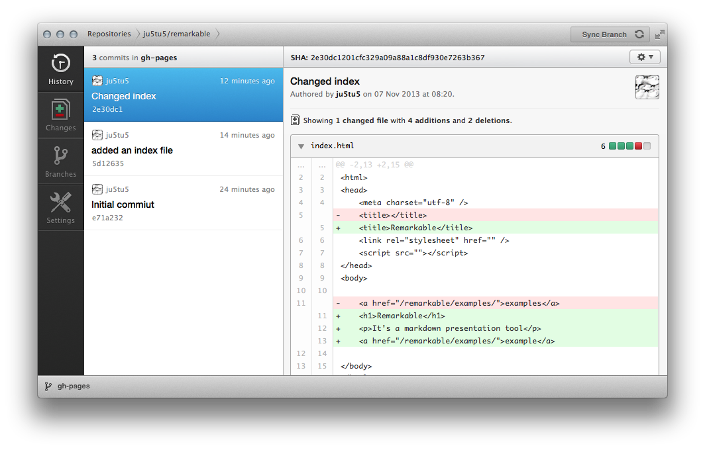
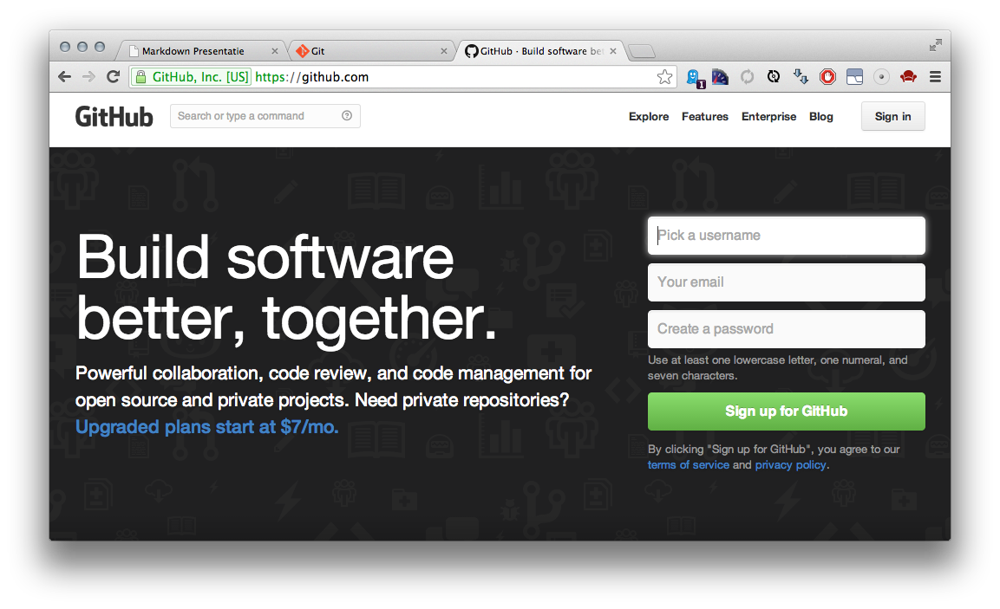
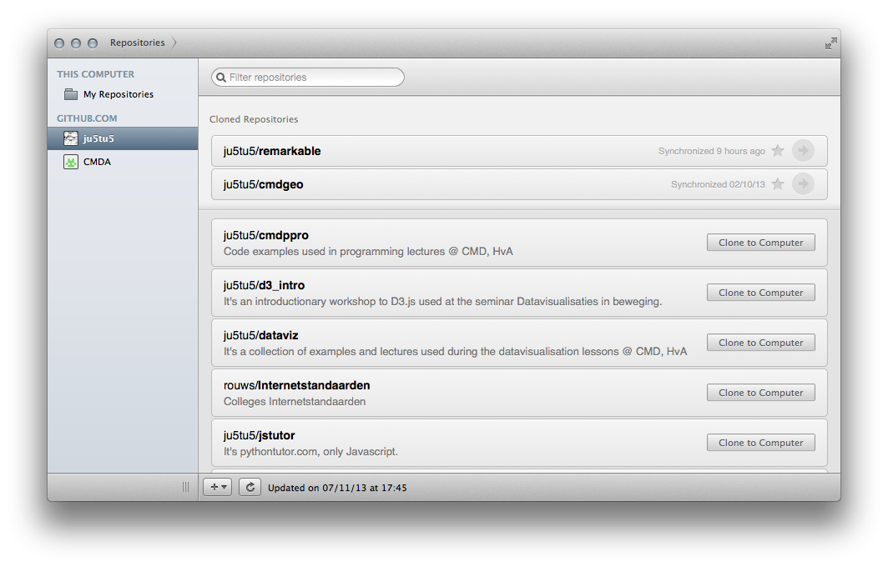
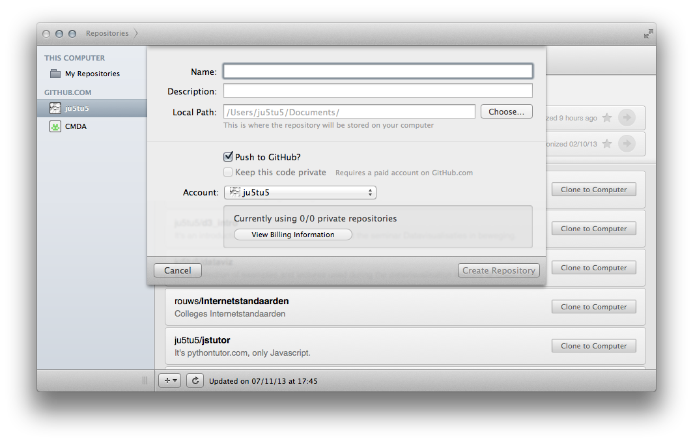
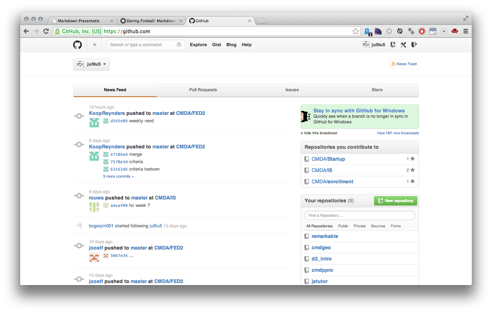
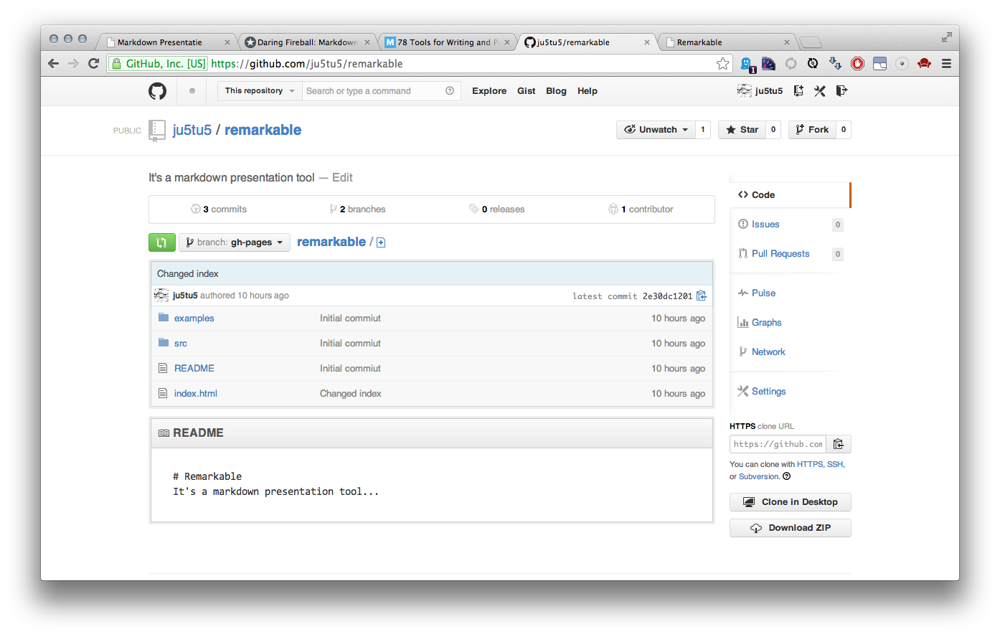
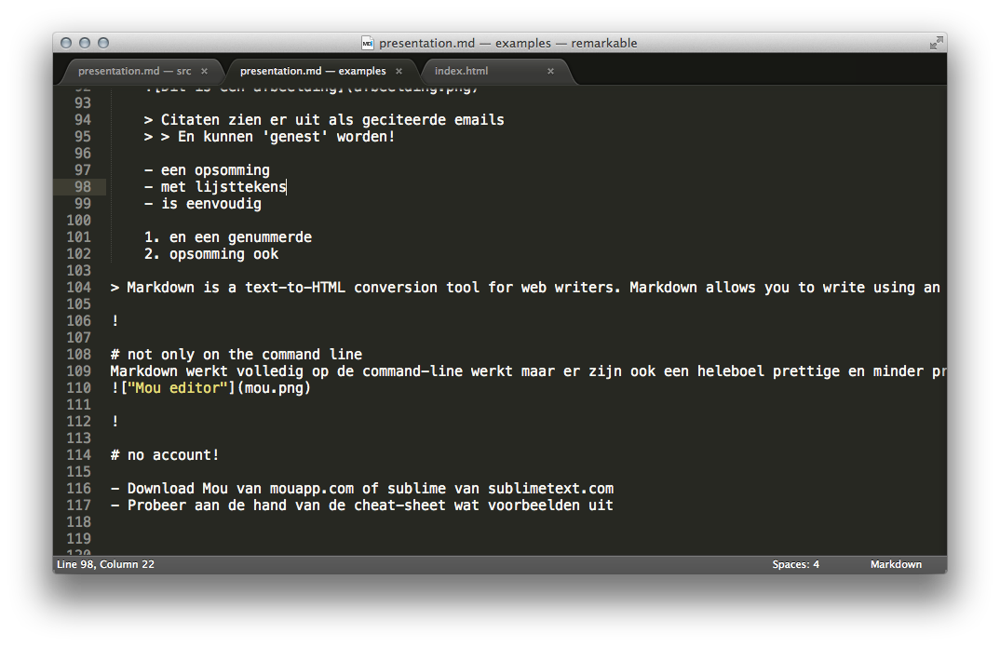
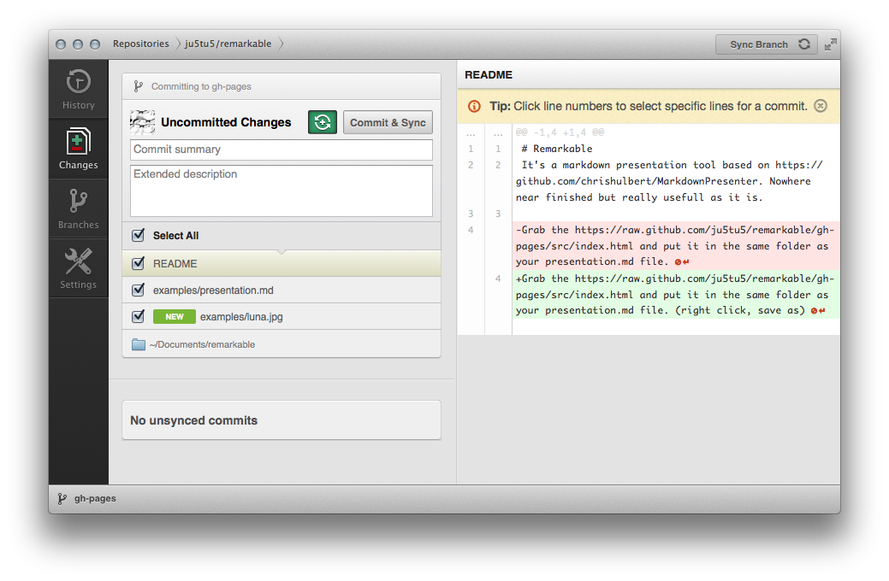
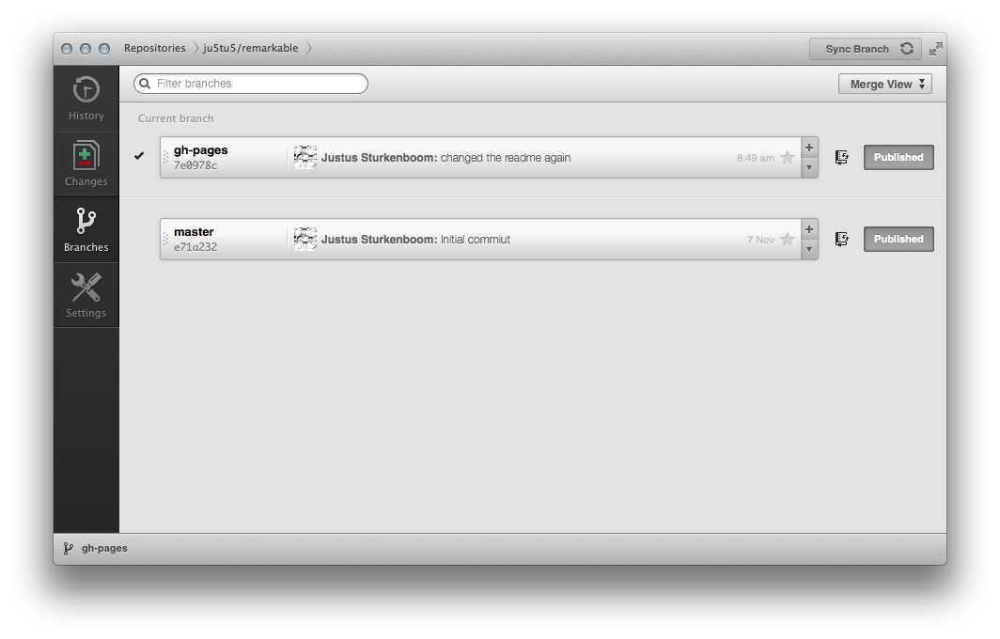

# remarkable?!
It's a markdown presentation tool

!

# git(hub) + markdown = remarkable
1. git voor versiebeheer (account en repository aanmaken)
2. markdown voor documenten (markdown README aanmaken)
3. remarkable voor presentaties (een HTML presentatie maken)

!

# git by Linus Torvalds

> Git is a free and open source distributed version control system designed to handle everything from small to very large projects with speed and efficiency. - git-scm.com

!

# not only on the command line
git werkt volledig op de command-line maar er zijn ook een heleboel prettige en minder prettige GUI's

!

# another account? (github.com)

- Download de client voor jouw OS
- Maak een account aan op github.com
- Geef als je klaar bent jouw git-username door aan Joost of Justus

!

# hello world i'm a repository

- Maak een nieuwe repository aan door op het plusje te klikken (onderin op MacOS, bovenin op Windows)

!

# hello world i'm a repository

- Geef een zinnige naam (bv. presentations of workshops) en een korte beschrijving (bv. It's a collection of presentations used for X)
- Kies een lokale map waar je dit project in wilt aanmaken
- Laat het vakje 'Push to GitHub?' aangevinkt
- Gebruik je eigen account (om vervuiling van CMDA/ te voorkomen)
- Klik vervolgens op 'Create Repository'

!

# hello world i'm a repository

- Controleer op github.com of je repository is aangemaakt
- Open de zojuist aangemaakte repository door er op te klikken

!

# hello world i'm a repository

!

# so much for git :)

!

# how about markdown?

!

# markdown by John Gruber

    # Header 1
    ## Header 2
    ### Header 3

    Dit is een paragraaf, wat neer komt op tekst
    omringd met witruimte. Tekst kan *italic* en
    **bold** gemaakt worden.

    [Dit is een link](http://example.com)
    

    > Citaten zien er uit als geciteerde emails
    > > En kunnen 'genest' worden!

    - een opsomming
    - met lijsttekens
    - is eenvoudig

    1. en een genummerde
    2. opsomming ook

> Markdown is a text-to-HTML conversion tool for web writers. Markdown allows you to write using an easy-to-read, easy-to-write plain text format, then convert it to structurally valid XHTML (or HTML). - daringfireball.net

!

# not only on the command line
Markdown werkt volledig op de command-line maar er zijn ook een heleboel prettige en minder prettige [GUI's](http://mashable.com/2013/06/24/markdown-tools/ "Mashable - 78 Tools for Writing and Previewing Markdown")

!

# not only on the command line
Maar elke 'kale tekst'-editor werkt ook fantastisch

!

# no account!

- Download Mou van [mouapp.com](http://mouapp.com) of sublime van [sublimetext.com](http://sublimetext.com)
- Probeer aan de hand van de cheat-sheet wat voorbeelden uit

!

# so much for markdown :)

!

# how about remarkable?

!

# remarkable van mij ^.^//
> Remarkable, gebaseerd op [MarkdownPresenter van Chris Hulbert](https://github.com/chrishulbert/MarkdownPresenter), is een tool waarmee je bij het voorbereiden van presentaties bezig kunt zijn met de inhoud in plaats van de vorm. - J.P. Sturkenboom

github + markdown = remarkable

!

# let's get to work

- Zoek in je Github Client de repository die we hebben aangemaakt
- Open ook de door jou gekozen Markdown editor
- Maak een nieuw bestand in de Markdown editor
- Sla het bestand op in de 'lokale map' die bij je repository hoort, noem het 'presentation.md'

!

# neem de volgende tekst over

    # Hallo wereld
    Een eerste presentatie in remarkable

    !

    # Vandaag
    - heb ik geleerd wat git/github zijn
    - wat Markdown is
    - hoe ik met remarkable een presentatie maak

    !

    # Vragen?

    Is dit alles? Ja.. dit is alles

- Sla het bestand vervolgens opnieuw op

!

# le magique

- Download het bestand index.html van [https://github.com/ju5tu5/remarkable](https://github.com/ju5tu5/remarkable) en zet het in de repository in dezelfde map als 'presentation.md'

!

# Publiceren op github

- Selecteer de repository (als je dat nog niet gedaan had)
- Vul een zinnige 'Commit summary' in, 'extended description' mag je leeg laten
- Selecteer 'Commit & Sync', niet enkel sync (dat doe je als iemand anders aanpassingen heeft gemaakt)
- Klik op 'Commit & Sync'

!

# de gh-pages branch

- Klik op het tabblad 'Branches'
- Klik op het plusje bij de 'master' branch
- geef als naam 'gh-pages' op (let op: kleine letters)
- Ga terug naar het tab 'Changes'
- Vul een zinnige 'Commit summary' in
- Klik opnieuw op 'Commit & Sync'

!

# Wait 10 mins..

    http://jouwnaam.github.io/repositorynaam

Maar je kunt natuurlijk ook een domeinnaam koppelen, als je een domeinnaam onder het domein cmdproject.nl wilt.. let me know

!

# Vragen?

- Ja.. je kunt het uiterlijk van de presentatie zelf aanpassen.
- Mocht je besluiten je vak op deze manier te gaan presenteren help ik je graag met het opzetten van de omgeving.